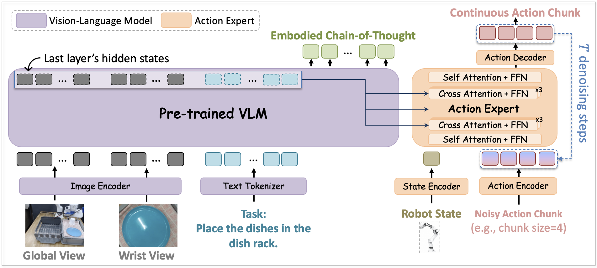
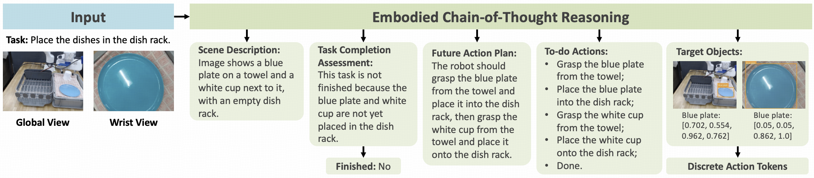

# ZR-0: Training Vision-Language-Action Models with Dense Embodied Chain-of-Thought Supervision

**ZR-0** is a pre-trained Vision-Language-Action (VLA) foundation model designed for general-purpose robotic manipulation.  

<p align="center">
  
  <br>
  <em>ZR-0 System Overview: Joint Vision–Language Reasoning and Continuous Action Control</em>
</p>

---

## Table of Contents
- [What is ZR-0?](#what-is-zr-0)
- [Key Features](#key-features)
- [Target Audience](#target-audience)
- [Quick Start](#quick-start)
  - [Environment Setup](#environment-setup)
  - [Model Checkpoints](#model-checkpoints)
  - [Model Inference](#model-inference)
  - [Evaluation](#evaluation)
  - [Fine-Tuning ZR-0 on Custom Datasets](#fine-tuning-zr-0-on-custom-datasets)
- [Current & Future Work](#current--future-work)
- [Contributors](#contributors)
- [Acknowledgements](#acknowledgements)

---

## What is ZR-0?

ZR-0 is a 2.6B parameter end-to-end Vision-Language-Action (VLA) model that leverages dense Embodied Chain-of-Thought (ECoT) supervision to learn cross-embodiment representations for robotic manipulation.

**Architecture.** ZR-0 adopts a dual-stream architecture: a pre-trained VLM (Qwen3-VL-2B) serves as System 2 for structured reasoning, while a Diffusion Transformer (DiT)-based action expert serves as System 1 for continuous action generation via flow matching. The two are coupled through cross-attention, with an attention mask that allows ECoT to be entirely skipped at inference, achieving ~90ms per action chunk on a single A6000 GPU.

**Training Data.** ZR-0 is pre-trained on [ProcCorpus-60M](https://procvlm.github.io/), comprising 60M+ frames (~1,000 hours) from 400K+ trajectories across diverse embodiments (Franka, xArm, GR-1, ALOHA, ARX5, UR5, etc.), with 96.8% of frames annotated with dense ECoT reasoning traces.

<p align="center">
  
  <br>
  <em>Example of Embodied Chain-of-Thought Reasoning</em>
</p>

**Training Objectives.** ZR-0 is jointly optimized with two objectives: next-token prediction for ECoT reasoning, and flow-matching for continuous action chunk generation. Dense ECoT supervision provides rich gradient signals that align the VLM's representations across heterogeneous embodiments, enabling effective cross-embodiment knowledge transfer.

**Results.** Fine-tuned from the pre-trained checkpoint, ZR-0 achieves strong performance across single-arm (LIBERO, 97.8%), humanoid (RoboCasa GR-1 Tabletop, 69.3%), bimanual (RoboTwin 2.0, 88.70%/87.98%), and real-world xArm tasks.

---

## Quick Start

### Environment Setup

```sh
# Step 1: Clone this repo
git clone https://github.com/RUCKBReasoning/ZR-0

# Step 2: Create and activate Conda environment
conda create -y -n ZR-0 python=3.10
conda activate ZR-0

# Step 3: Install LeRobot
cd lerobot
pip install -e .
cd ..

# Step 4: Install additional dependencies
pip install -r requirements.txt
conda install -c conda-forge ffmpeg

# Step 5: Install flash attention
pip install flash-attn --no-build-isolation
```

<details close>
<summary><b>Common Issue: Installing flash-attn</b></summary>

Installing `flash-attn` can be challenging because the package version must match your system’s CUDA, Python, and PyTorch versions. While using the `--no-build-isolation` flag resolves most issues, some systems require a manual install:

1. Find a compatible `.whl` package for your setup on the [flash-attn 2.7.3 Releases](https://github.com/Dao-AILab/flash-attention/releases/tag/v2.7.3) page. Match the package to your CUDA, Python, and PyTorch versions.
2. For example, if you are using CUDA 12.1 (cu12), PyTorch 2.6.0 (torch2.6), and Python 3.10 (cp310), download: `flash_attn-2.7.3+cu12torch2.6cxx11abiFALSE-cp310-cp310-linux_x86_64.whl`.
3. Then, install it with: `pip install flash_attn-2.7.3+cu12torch2.6cxx11abiFALSE-cp310-cp310-linux_x86_64.whl`

</details>


---

### Model Checkpoints

#### Base Model

| Model          | Use Case             | Description                              | Checkpoint |
|----------------|---------------------|------------------------------------------|------------|
| ZR-0   | finetune | Pretrained (2.6B) foundation model      | [link](https://www.modelscope.cn/models/seeklhy/ZR-0)     |

This base model has been pre-trained on over 400k ECoT-enhanced robotic manipulation trajectories and 5M general VQA samples. It can be further fine-tuned to adapt to your specific robots and tasks.

#### Fine-Tuned Models

We also provide some fine-tuned checkpoints. These models are fine-tuned from the base model above and intended to run directly on the target environment. 

| Model                  | Base Model        | Description       | Checkpoint |
|------------------------|-------------|-------------------|------------|
| ZR-0-LIBERO    | ZR-0 | Finetuned on [LIBERO](https://huggingface.co/datasets/physical-intelligence/libero)   | [link](https://www.modelscope.cn/models/seeklhy/ZR-0-libero)     |
| ZR-0-RoboTwin2.0-Aloha-AgileX   | ZR-0 | Finetuned on [RoboTwin2.0 ALOHA AgileX](https://huggingface.co/datasets/TianxingChen/RoboTwin2.0)  | [link](https://www.modelscope.cn/models/seeklhy/ZR-0-robotwin)     |
| ZR-0-Robocasa-GR1    | ZR-0 | Finetuned on [RoboCasa GR1 Tabletop Tasks](https://huggingface.co/datasets/nvidia/PhysicalAI-Robotics-GR00T-Teleop-Sim)   | [link](https://www.modelscope.cn/models/seeklhy/ZR-0-robocasa)     |

---

### Model Inference

**System performance (bf16, 5 denoise steps, torch.compile, single 224x224x3 camera):**

| Device  | Image Processor (cpu) | VLM Backbone | Action Expert | End-to-End | Control Freq. |
|---------|------------------|---------------|------------|---------------|-------------------|
| A6000   | 4 ms             | 49 ms         | 35 ms      | 88 ms         |   11.37 Hz        |
| RTX 3090    | 4 ms             | 69 ms         | 62 ms      | 135 ms        |   7.41 Hz         |

---

### Evaluation

**Architecture:** The client (robot) and server (VLA model) communicate via WebSocket.  
This design isolates the robot environment from the model server, preventing conflicts and enabling distributed or edge-device inference.

```
+-------------------+           observations            +---------------------+
|    Robot Arm      | ────────────────────────────────► |  Action Inference   |
|     (Client)      |   (Images + Task + Robot State)   |   (Model Server)    |
+-------------------+                                   +---------------------+
          ▲                                                       │
          │ <----------------- chunk of actions <-----------------┘
          │         (robot executes, new obs → repeat)
```

**Server:** Launch with desired dataset + checkpoint.

> **LIBERO Evaluation Example**
```sh
conda activate ZR-0
python server.py \
  --dataset_entry "demo_data.libero_v21" \
  --ckpt_dir /path/to/checkpoint/ZR-0-LIBERO \
  --inference_mode direct_action \
  --port 8000
```
`dataset_entry` **must match** keys in `dataset2feature.yaml`.


**Client:**  

You can use this template to interact with any environment in a client-server evaluation workflow:

```python
from utils.websocket_client_policy import WebsocketClientPolicy

# Initialize the client and connect to the model server
client = WebsocketClientPolicy(host, port)

# Initialize the environment
env = YourEnv()

for episode in range(NUM_EPISODES):
    obs = env.reset()
    done = False
    while not done:
        # Prepare the request payload (example with two camera views)
        request_data = {
            "observation.images.image": convert_to_numpy_array(obs['image']),
            "observation.images.wrist_image": convert_to_numpy_array(obs['wrist_image']),
            "observation.state": obs['state_vector'],
            "task": obs['task_description'],
            "n_action_steps": N_ACTION_STEPS
        }
        # Query the model server for an action chunk
        action_chunk = client.infer(request_data)["actions"]
        # Step through the environment with each predicted action
        for action in action_chunk:
            obs, reward, done, info = env.step(action)
            if done:
                break
```

For ready-to-use client scripts for various simulation environments, please refer to:
- [LIBERO](evaluation/libero_eval/README.md)
- [RoboCasa GR1 Tabletop Tasks](evaluation/robocasa_gr1_tabletop_tasks_eval/README.md)
- [RoboTwin2.0-Aloha-AgileX](evaluation/RoboTwin/README.md)

---

### Fine-Tuning ZR-0 on Custom Datasets

We provide flexible fine-tuning scripts, enabling you to adapt ZR-0 to your own applications. Below, we walk through the process using the LIBERO dataset as an example.

---

#### Step 1: Prepare Your Dataset in LeRobotDataset Format

ZR-0 leverages the LeRobot v2 format for organizing robotics datasets (v2.0 and v2.1 are both supported).

- **Example: LIBERO Dataset**  
  To download the LIBERO dataset in the v2.1 format, use the following command:
  ```sh
  hf download HuggingFaceVLA/libero --repo-type=dataset --revision v2.1 --local-dir /your/path/to/libero
  ```
  The `--revision v2.1` flag ensures that you download the LeRobot v2.1 version of the dataset.

- **For Other Dataset Versions:**  
  If your data is in another LeRobot format, you can use the [any4lerobot conversion scripts](https://github.com/Tavish9/any4lerobot/tree/main/ds_version_convert) to convert it to LeRobot v2.

- **Compute Global Statistics:**  
  Before fine-tuning, calculate global statistics (used for normalization/denormalization during training and inference):

  ```sh
  python calculate_global_stats.py --dataset_path /your/path/to/libero
  ```

  This command generates the statistics file at `/your/path/to/libero/meta/stats.json`.

---

#### Step 2: Register Your Dataset

Edit the `dataset2feature.yaml` file to register your dataset for training and evaluation. For your downloaded LIBERO dataset, add:

```yaml
libero_finetuning:
  dataset_path: /your/path/to/libero
  dataset_type: vla
  sample_ratio: 1.0
  use_quantile: true
```

---

#### Step 3: Fine-Tune the Model

Launch fine-tuning using the provided script. For example, on a single node with 8 GPUs:

```sh
CUDA_VISIBLE_DEVICES=0,1,2,3,4,5,6,7 accelerate launch \
    --num_processes 8 \
    --config_file ./accelerate_configs/accelerate_config.yaml \
    train_vla.py \
    --vlm_name_or_path "/path/to/checkpoint/ZR-0" \
    --action_expert_name_or_path "/path/to/checkpoint/ZR-0" \
    --FAST_tokenizer_path "/path/to/fast/tokenizer" \
    --per_device_train_batch_size 8 \
    --seed 42 \
    --epochs 8 \
    --save_ckpt_interval 4 \
    --save_step_interval 1000000 \
    --peak_learning_rate 2e-5 \
    --min_lr_rate 0.1 \
    --tensorboard_log_dir "./outputs/train_logs/ZR-0-LIBERO-finetuning" \
    --output_ckpt_dir "./outputs/ckpts/ZR-0-LIBERO-finetuning" \
    --tune_vlm \
    --tune_action_expert \
    --loss_type "action" \
    --lr_scheduler "cosine" \
    --dataset_entries "libero_finetuning" \
    --window_size 1 \
    --action_horizon 10 \
    --max_pad_state_and_action_length 64
```

- Training progress is printed in the console.
- The FAST tokenizer is available for download at [https://huggingface.co/physical-intelligence/fast](https://huggingface.co/physical-intelligence/fast).
- Checkpoints are saved to the `output_ckpt_dir`.
- Monitor training metrics with TensorBoard:

  ```sh
  tensorboard --logdir ./outputs/train_logs/ZR-0-LIBERO-finetuning
  ```

> **Note:** To augment your VLA datasets with ECoT for joint training, please refer to the ProcVLM repository: [ProcVLM](https://github.com/ProcVLM/ProcVLM).

---

#### Step 4: Evaluate on LIBERO

Once fine-tuning is complete, you can evaluate the resulting checkpoints using a server-client architecture.

**1. Start the Server**  
Open one terminal and run:

```sh
conda activate ZR-0
python server.py \
    --dataset_entry libero_finetuning \
    --ckpt_dir ./outputs/ckpts/ZR-0-LIBERO-finetuning/step-xxxxx \
    --inference_mode direct_action \
    --port 8000
```

This launches a server on port 8000 which will wait for incoming observation queries.

**2. Run the Client**  
In a second terminal:

```sh
conda activate libero
python -m evaluation.libero_eval.run_libero_eval \
    --args.replan_steps 10 \
    --args.task-suite-name libero_spatial \
    --args.port 8000
```

> **Note:**  
> The `libero` conda environment is required for the LIBERO simulation. Please see [LIBERO README](evaluation/libero_eval/README.md) for details.

---

#### Advanced Features

For more information about advanced options, such as multi-node finetuning, training model with a mixture of datasets, enabling VQA data co-training, preparing ECoT for model training, and LoRA-based finetuning—please, refer to [README-advanced-features.md](README-advanced-features.md).

---

## Acknowledgements

ZR-0 is inspired by, and builds on, pioneering open-source efforts:

- [LeRobot](https://github.com/huggingface/lerobot)
- [Isaac-GR00T](https://github.com/NVIDIA/Isaac-GR00T)
- [openpi](https://github.com/Physical-Intelligence/openpi)
- [starVLA](https://github.com/starVLA/starVLA)
- [accelerate](https://github.com/huggingface/accelerate)
- [Deepspeed](https://github.com/deepspeedai/DeepSpeed)
- [any4lerobot](https://github.com/Tavish9/any4lerobot/tree/main)
- [Qwen3-VL](https://github.com/QwenLM/Qwen3-VL)

_We are deeply grateful to all creators and contributors who make the community thrive._

---
